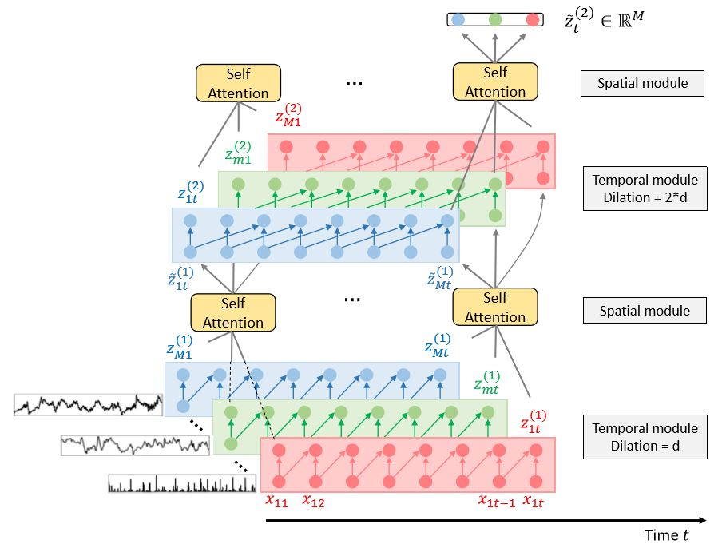

# wattnet-fx-trading
WATTNet: Learning to Trade FX with Hierarchical Spatio-Temporal Representations of Highly Multivariate Time Series: [paper](https://arxiv.org/abs/1909.10801), [article](https://medium.com/neuri-ai/wattnet-learning-to-trade-fx-with-hierarchical-spatio-temporal-representations-of-highly-bbd0f02c812f)

<p align="center"> 

</p>

> Finance is a particularly challenging application area for deep learning models due to low noise-to-signal ratio, non-stationarity, and partial observability. Non-deliverable-forwards (NDF), a derivatives contract used in foreign exchange (FX) trading, presents additional difficulty in the form of long-term planning required for an effective selection of start and end date of the contract. In this work, we focus on tackling the problem of NDF tenor selection by leveraging high-dimensional sequential data consisting of spot rates, technical indicators and expert tenor patterns. To this end, we construct a dataset from the Depository Trust & Clearing Corporation (DTCC) NDF data that includes a comprehensive list of NDF volumes and daily spot rates for 64 FX pairs. We introduce WaveATTentionNet (WATTNet), a novel temporal convolution (TCN) model for spatio-temporal modeling of highly multivariate time series, and validate it across NDF markets with varying degrees of dissimilarity between the training and test periods in terms of volatility and general market regimes. The proposed method achieves a significant positive return on investment (ROI) in all NDF markets under analysis, outperforming recurrent and classical baselines by a wide margin. Finally, we propose two orthogonal interpretability approaches to verify noise stability and detect the driving factors of the learned tenor selection strategy.

## Installation

``` pip install git+https://github.com/Zymrael/wattnet-fx-trading ```

## Code availability
Scripts to download and preprocess the data, as well as PyTorch code for training and evaluating the models will be made available at a later date for reproducibility purposes. For clarifications or inquiries about the code, contact michael [at] neuri.ai.


For any request, feel free to open a thread under `Issues`.

If you find our work interesting or useful, consider citing our work:
```
@article{poli2019wattnet,
  title={WATTNet: Learning to Trade FX via Hierarchical Spatio-Temporal Representation of Highly Multivariate Time Series},
  author={Poli, Michael and Park, Jinkyoo and Ilievski, Ilija},
  journal={arXiv preprint arXiv:1909.10801},
  year={2019}
}
```

